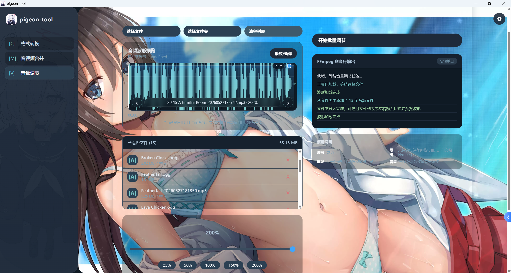
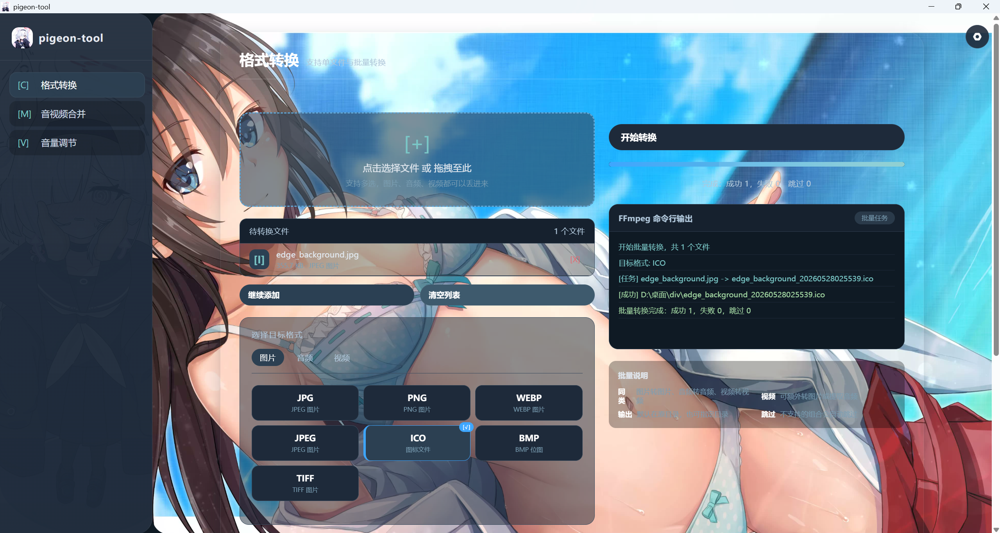
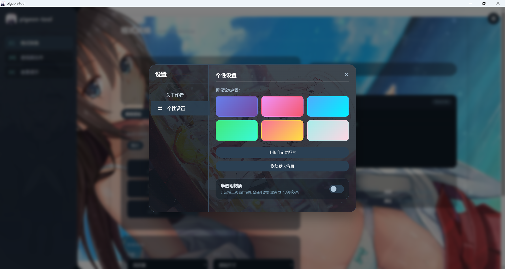
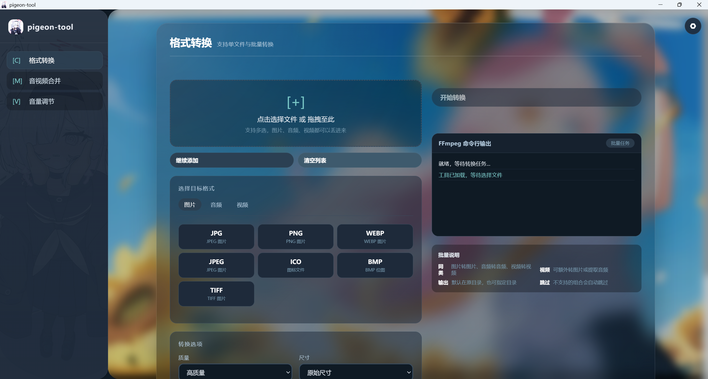
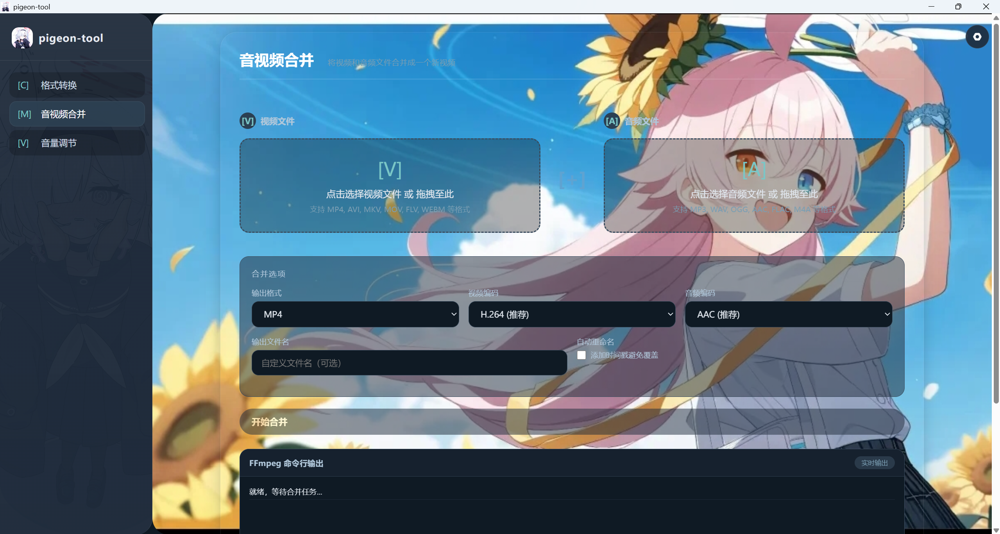

# Pigeon Tool

Anime-style FFmpeg GUI toolbox built with Wails.

Pigeon Tool is a lightweight desktop media toolbox designed to make FFmpeg easier to use through a modern GUI interface.

The original idea behind this project was simple:

FFmpeg is extremely powerful, but command-line workflows can be inconvenient for everyday users.
Pigeon Tool provides a visual desktop experience with an anime-inspired dark UI style, allowing common media tasks to be completed more easily.

---

# Preview

## Audio Waveform

Audio waveform visualization and volume adjustment interface.



---

## Format Conversion

Media format conversion with batch task support.



---

## Personalization Settings

Customizable anime-style UI settings page.



---

## Translucent Material

Acrylic translucent material effect.



---

## Background Switching

Dynamic background switching support.



---

# Features

* Media format conversion
* Batch conversion tasks
* Audio and video merging
* Audio volume adjustment
* Audio waveform visualization
* Anime-inspired dark UI
* Acrylic translucent material effect
* Dynamic background switching
* FFmpeg-based processing
* Single executable release support

---

# Tech Stack

* Wails
* Go
* JavaScript
* HTML / CSS
* Python
* FFmpeg
* WaveSurfer.js

---

# Development

Run development mode:

```bash
wails dev
```

Build executable:

```bash
wails build -o pigeon-tool.exe -clean -trimpath
```

Optional UPX compression:

```bash
upx --best --lzma pigeon-tool.exe
```

---

# Requirements

* Windows
* FFmpeg
* Python

Some release builds may already include runtime dependencies.

If FFmpeg is not included, place `ffmpeg.exe` in the application directory or install FFmpeg separately.

---

# Third-party Components

This project uses FFmpeg for media processing.

FFmpeg is licensed under its own LGPL/GPL license terms depending on the build configuration.

See:

https://ffmpeg.org/legal.html

This project also uses WaveSurfer.js for waveform rendering.

---

# License

This project is licensed under the MIT License.

See the `LICENSE` file for details.

---

# Author

Created by Pigeon.

Contact:

[cyd580413@gmail.com](mailto:cyd580413@gmail.com)
